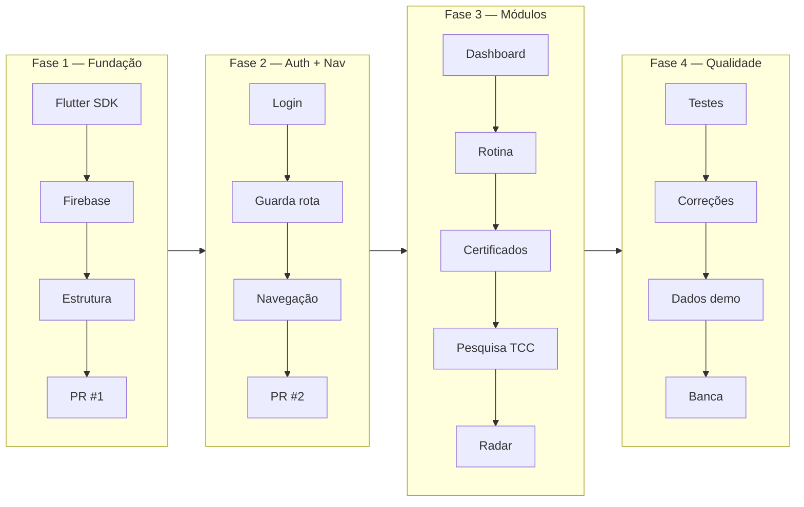
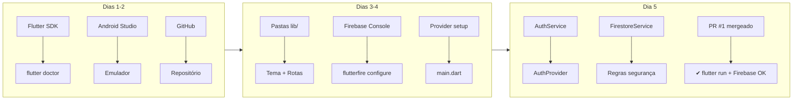
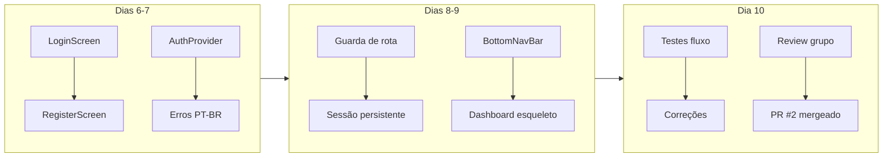
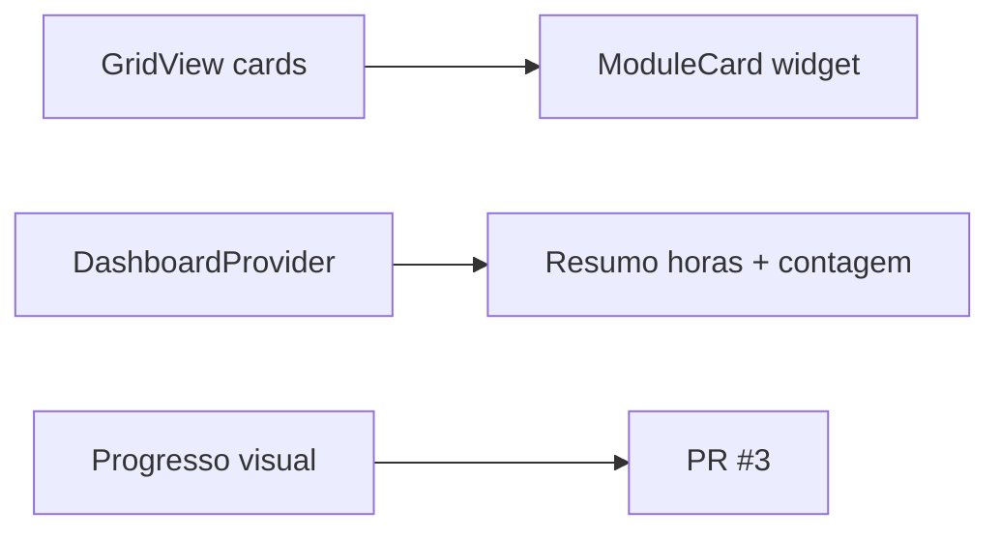
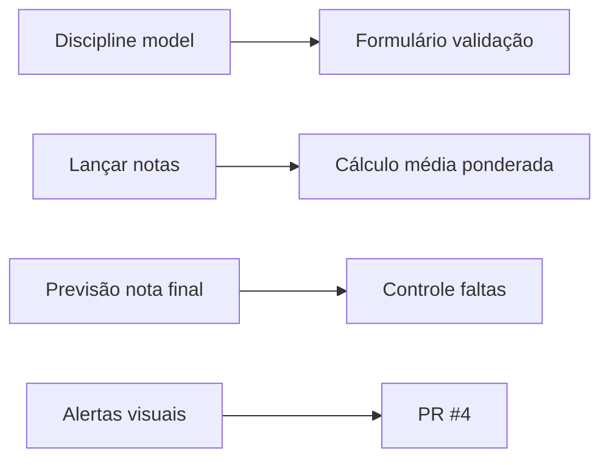
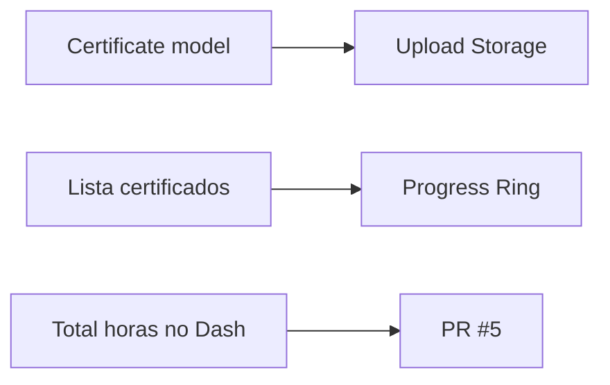
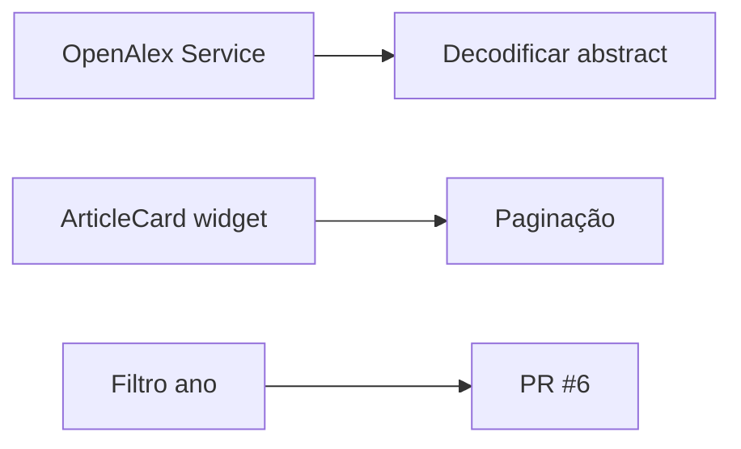
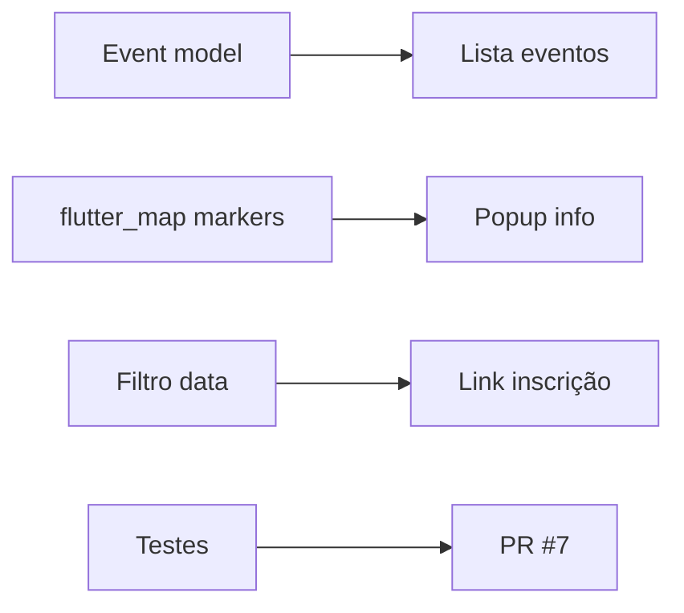
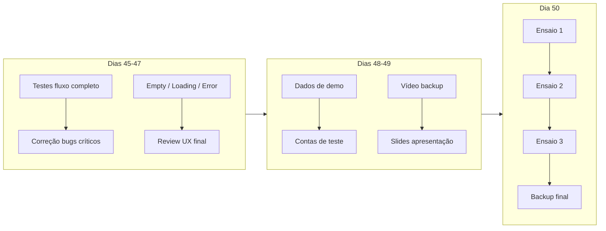

# Roadmap — Guideline Técnico

---

## Fase 1 — Fundação (Dias 1-5)

### Entregas da Fase 1

- `flutter run` funcionando sem erros
- Firebase conectado (Auth, Firestore, Storage)
- Estrutura de pastas criada (`core/`, `data/`, `features/`, `providers/`)
- Tema global definido
- AuthService + FirestoreService + AuthProvider implementados
- PR #1 aprovado e mergeado na `develop`

---

## Fase 2 — Auth + Navegação (Dias 6-10)

### Entregas da Fase 2

- Criar conta → dashboard automatizado
- Login com email existente → dashboard
- Logout → volta para login
- Fechar e reabrir app → continua logado
- Mensagens de erro em português
- PR #2 mergeado

---

## Fase 3 — Módulos (Dias 11-44)

### Dashboard (Dias 11-14)

### Rotina (Dias 15-22)

### Certificados (Dias 23-30)

### Pesquisa TCC (Dias 31-37)

### Radar Eventos (Dias 38-44)

---

## Fase 4 — Qualidade + Banca (Dias 45-50)

### Checklist Final da Banca

- **Auth:** login, cadastro, logout, sessão persistente
- **Dashboard:** cards dos módulos, resumo horas, contagem disciplinas
- **Rotina:** CRUD disciplinas, cálculo média, previsão final, faltas
- **Certificados:** upload, lista, progresso visual
- **Pesquisa TCC:** busca OpenAlex, cards com dados
- **Radar:** lista eventos, mapa com markers
- **Qualidade:** loading em tudo, erro tratado, empty states
- **Apresentação:** 3 ensaios, vídeo backup, slides prontos
