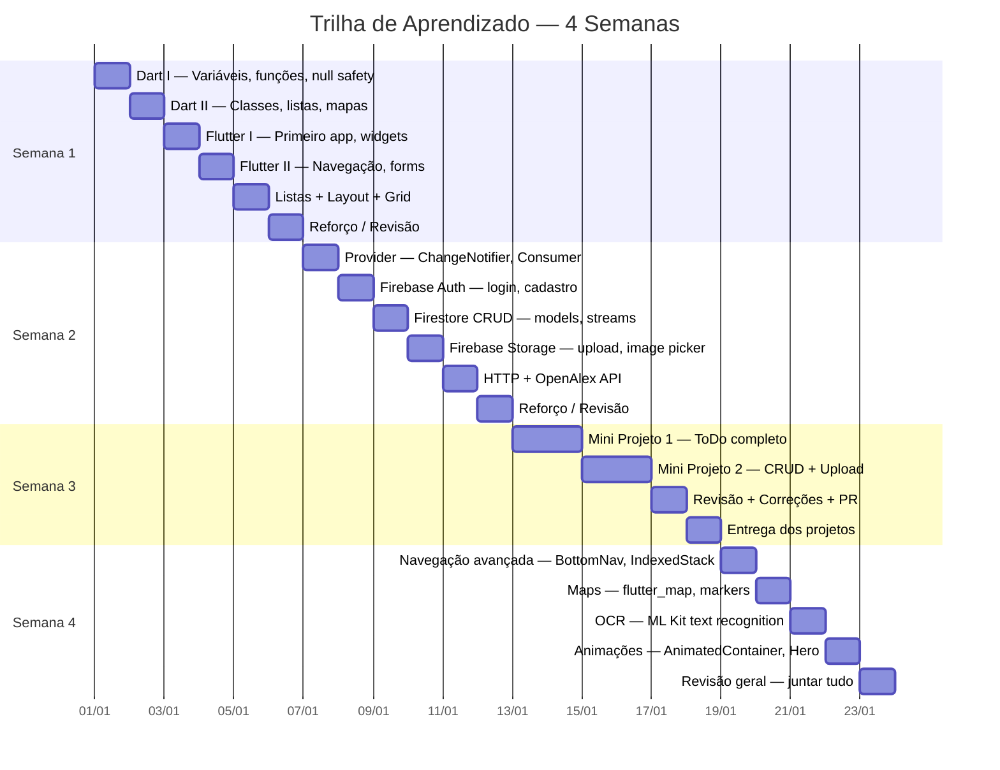
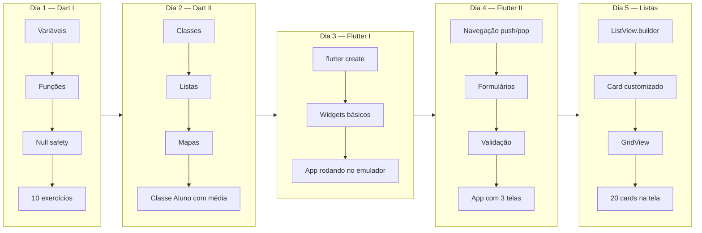
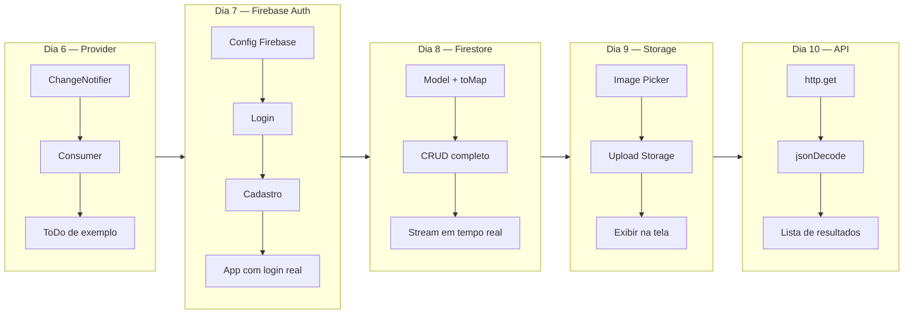
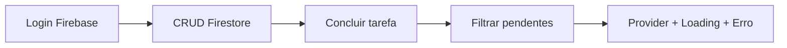
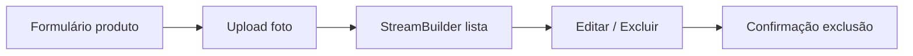
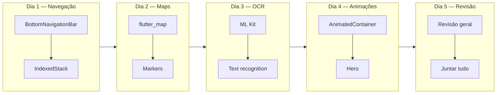
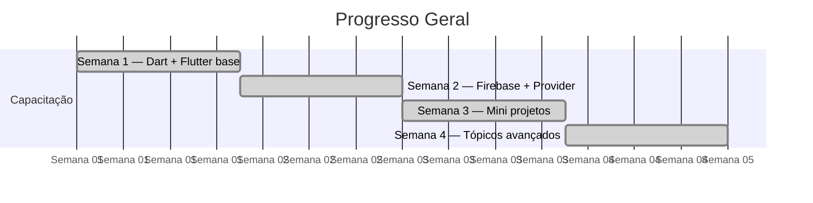

# Roadmap — Plano de Estudos

---

## Semana 1 — Dart + Flutter Base

**Marco da Semana 1:** App com 3 telas navegáveis + formulário com validação rodando no emulador.

---

## Semana 2 — Firebase + Provider

**Marco da Semana 2:** 2 apps rodando — (1) ToDo com Provider (2) Login + CRUD Firestore. Cada membro entrega individualmente.

---

## Semana 3 — Mini Projetos Obrigatórios

### Mini Projeto 1 — ToDo List (2 dias)

### Mini Projeto 2 — CRUD + Upload (2 dias)

**Marco da Semana 3:** 2 mini projetos completos no GitHub. Cada membro sabe fazer CRUD completo + Auth + upload.

---

## Semana 4 — Avançado + Integrações

---

## Progresso da Trilha

---

## Meta Final dos Estudos

Cada membro deve conseguir, **sozinho**:

- Criar uma tela Flutter com formulário
- Navegar entre telas
- Salvar e ler dados no Firestore
- Implementar login com Firebase Auth
- Subir uma feature via branch + PR

> Se mais de 30% do time não conseguir, **repetir a semana** antes de avançar.
