# Roadmap — Plano de Execução

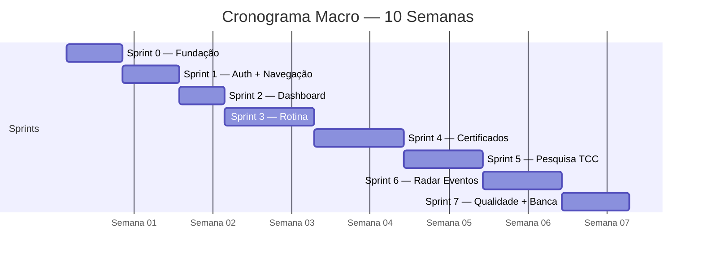

---

## Sprints Detalhadas

### Sprint 0 — Fundação (Dias 1-5)

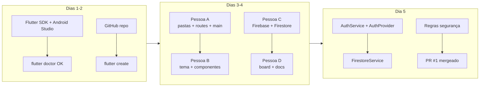

**Checkpoint:** `flutter run` sem erro ✅ | Firebase conectado ✅ | PR #1 mergeado ✅

---

### Sprint 1 — Auth + Navegação (Dias 6-10)

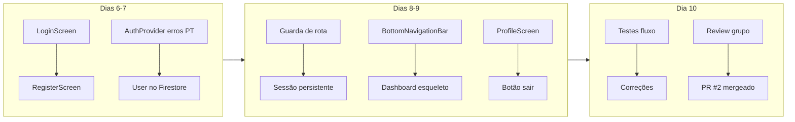

**Checkpoint:** Login/Cadastro ✅ | Sessão persistente ✅ | Navegação ✅ | PR #2 ✅

---

### Sprint 2 — Dashboard (Dias 11-14)

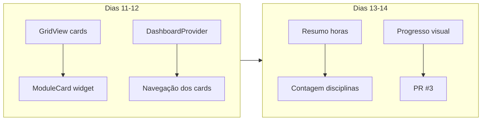

**Checkpoint:** Dashboard com cards ✅ | Resumo horas ✅ | Contagem ✅ | PR #3 ✅

---

### Sprint 3 — Rotina (Dias 15-22)

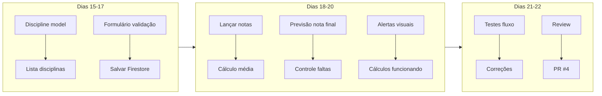

**Checkpoint:** CRUD disciplinas ✅ | Cálculo média ✅ | Previsão final ✅ | Faltas ✅ | PR #4 ✅

---

### Sprint 4 — Certificados (Dias 23-30)

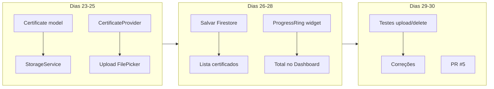

**Checkpoint:** Upload PDF/imagem ✅ | Lista certificados ✅ | Progresso visual ✅ | PR #5 ✅

---

### Sprint 5 — Pesquisa TCC (Dias 31-37)

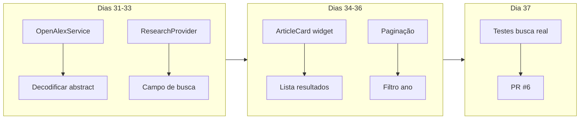

**Checkpoint:** Busca OpenAlex ✅ | Cards com dados ✅ | Loading/erro/vazio ✅ | PR #6 ✅

---

### Sprint 6 — Radar Eventos (Dias 38-44)

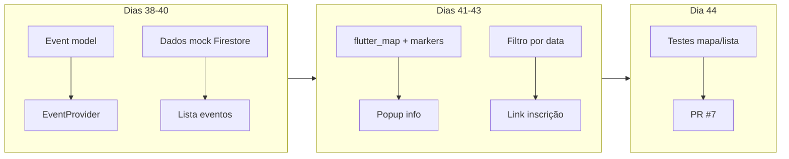

**Checkpoint:** Lista eventos ✅ | Mapa com markers ✅ | Popup ✅ | Filtro data ✅ | PR #7 ✅

---

### Sprint 7 — Qualidade + Banca (Dias 45-50)

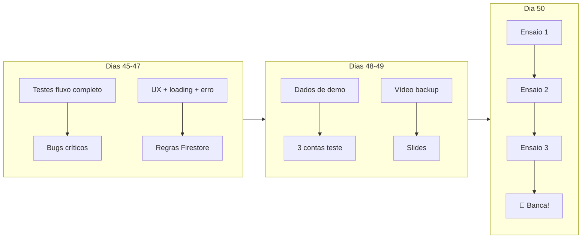

**Checkpoint Final:**

- Auth ✅ | Dashboard ✅ | Rotina ✅ | Certificados ✅ | Pesquisa ✅ | Radar ✅
- 3 ensaios realizados ✅ | Vídeo backup ✅ | Slides prontos ✅

---

## Plano de Contingência

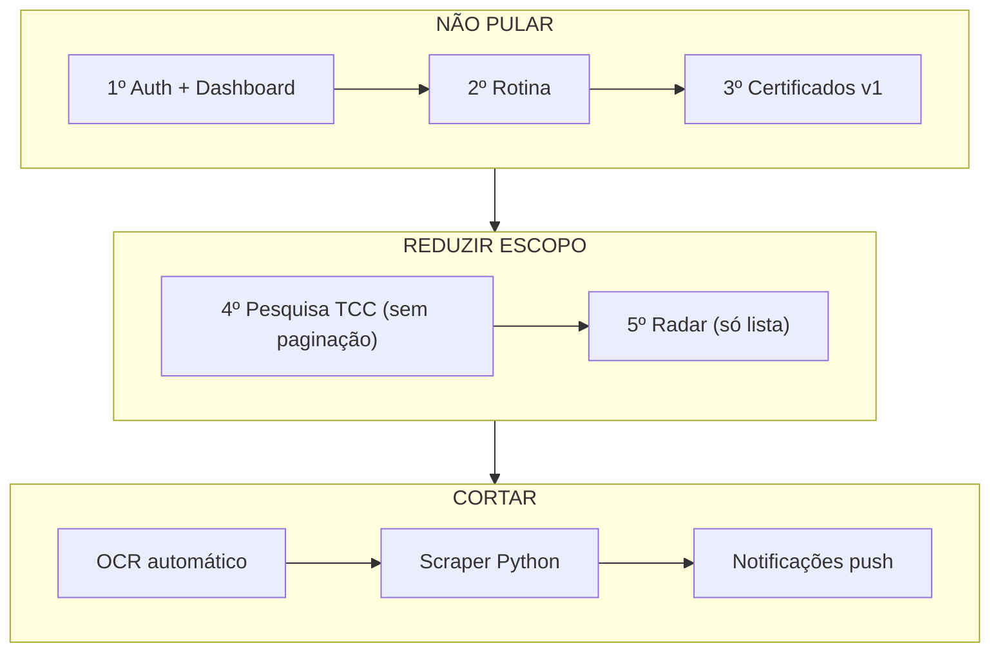

---

## Distribuição por Pessoa (Equipe de 4)

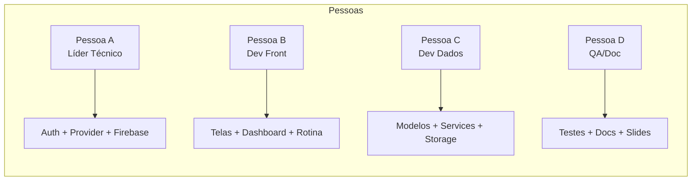
