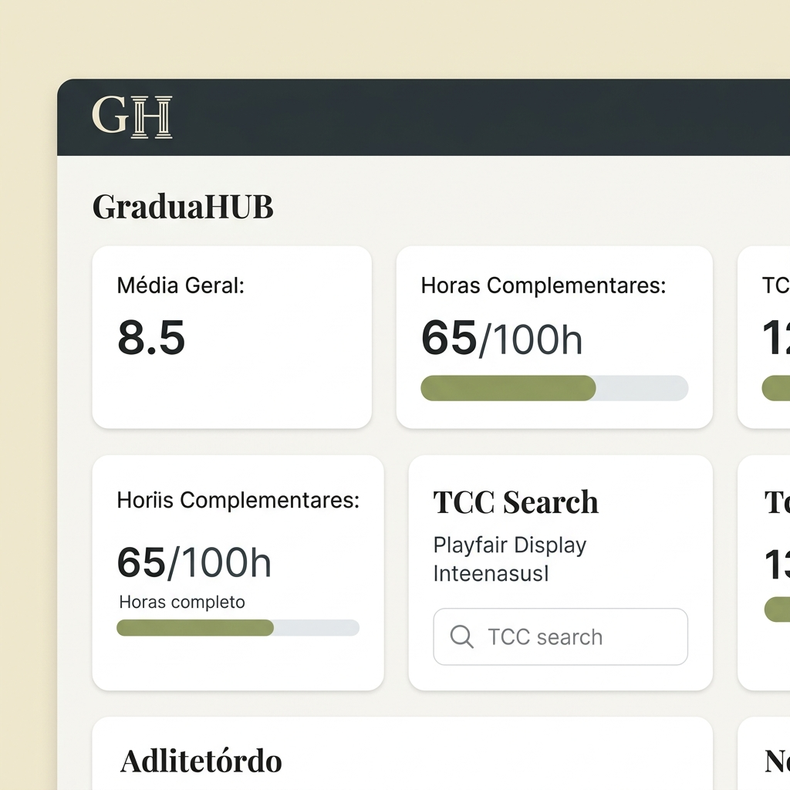

# GraduaHUB — Guia Visual e Técnico de Desenvolvimento
> **Status:** Documento Completo de Implementação (Substitui o MVP • Versão Final)  
> **Prazo de Entrega/Banca:** 27/09 a 04/10  
> **Identidade Visual:** Clássico Acadêmico Moderno (Navy Charcoal, Cream Parchment, Sage Olive)

---

## ✦ Mockup de Referência da Interface (Dashboard)
Abaixo está a representação visual de alta fidelidade da identidade visual acadêmica implementada no aplicativo:



> [!IMPORTANT]
> **Regra Geral de Design:** Nunca utilize fundo branco puro (`#FFFFFF`) nas telas. Use sempre o fundo Cream Parchment (`#F0EAD6`) para a janela/tela principal e Off-white (`#FAF8F3`) para as superfícies dos cards.

---

## 1. Módulo de Autenticação e Segurança (Auth)
O módulo de Autenticação gerencia a segurança e o controle de acesso de todos os dados do aluno.

### 1.1 Layout Visual da Tela
```
┌────────────────────────────────────────────────────────┐
│                        (GH)                            │ <── Monograma GH com colunas gregas
│                     GraduaHUB                          │ <── Fonte Playfair Display
│  "CONHECIMENTO QUE TRANSFORMA. TRADIÇÃO QUE PERMANECE"  │ <── Tagline (Inter Caps, letter-spacing: 3px)
│                                                        │
│  ┌──────────────────────────────────────────────────┐  │
│  │ E-mail Acadêmico                                 │  │ <── Card Off-white (#FAF8F3)
│  │ ──────────────────────────────────────────────── │  │
│  │ Senha                                            │  │
│  │ ──────────────────────────────────────────────── │  │
│  │                                                  │  │
│  │           [   ENTRAR / CADASTRAR   ]             │  │ <── Botão Navy (#2C3539), texto Cream
│  │                                                  │  │
│  │   Esqueci minha senha | Criar nova conta         │  │
│  └──────────────────────────────────────────────────┘  │
└────────────────────────────────────────────────────────┘
```

### 1.2 Estrutura do Banco de Dados (Firestore)
* **Coleção Principal:** `/users`
* **Documento:** `{uid}` (Gerado pelo Firebase Auth)

```json
{
  "name": "João da Silva",
  "email": "joao.silva@aluno.senai.br",
  "createdAt": "2026-07-09T13:17:20.000Z",
  "role": "student",
  "academicInfo": {
    "course": "Tecnologia em Análise e Desenvolvimento de Sistemas",
    "semester": 4,
    "registrationNumber": "20261102938"
  }
}
```

### 1.3 Lógica de Negócio e Validações
* **Validação de E-mail:** Deve obrigatoriamente seguir a expressão regular corporativa/acadêmica:
  $$\text{Regex: } \text{^[a-zA-Z0-9.\-_]+@[a-zA-Z0-9.\-_]+\.[a-zA-Z]\{2,6\}\$}$$
* **Força da Senha:** Mínimo de 6 caracteres no Firebase Auth.
* **Guarda de Rotas (Router Guard):** O status da autenticação (`FirebaseAuth.instance.currentUser`) é monitorado por um `ChangeNotifierProvider` (`AuthProvider`). Se o usuário for nulo, a aplicação redireciona imediatamente para `/login`.

### 1.4 Teste de Unidade & Widget
**Arquivo:** `test/features/auth/auth_provider_test.dart`
```dart
import 'package:flutter_test/flutter_test.dart';
import 'package:mocktail/mocktail.dart';
import 'package:firebase_auth/firebase_auth.dart';
import 'package:graduahub/providers/auth_provider.dart';

class MockFirebaseAuth extends Mock implements FirebaseAuth {}
class MockUser extends Mock implements User {}

void main() {
  late AuthProvider authProvider;
  late MockFirebaseAuth mockAuth;

  setUp(() {
    mockAuth = MockFirebaseAuth();
    authProvider = AuthProvider(auth: mockAuth);
  });

  test('Deve mudar estado para deslogado ao chamar signOut', () async {
    when(() => mockAuth.signOut()).thenAnswer((_) async => {});
    await authProvider.logout();
    expect(authProvider.isAuthenticated, false);
  });
}
```

### 1.5 Checklist de Desenvolvimento
- [ ] Conectar app ao console do Firebase (`flutterfire configure`).
- [ ] Ativar método de login de e-mail e senha no Firebase Auth Console.
- [ ] Implementar classe `AuthService` com métodos `signInWithEmailAndPassword`, `createUserWithEmailAndPassword` e `signOut`.
- [ ] Implementar tela visual `LoginScreen` seguindo a paleta clássica e aplicando o monograma GH em SVG.
- [ ] Escrever testes de widget para validar campos de entrada vazios e mensagens de erro.

---

## 2. Dashboard Principal (Central do Aluno)
O Dashboard consolida os dados de todos os outros módulos em uma única visualização rápida com cards dinâmicos.

### 2.1 Layout Visual da Tela
```
┌────────────────────────────────────────────────────────┐
│ [Menu Hamburger]       (GH) GraduaHUB      [Notificação]│ <── Topbar Navy (#2C3539)
├────────────────────────────────────────────────────────┤
│ Olá, João da Silva                                     │
│ Quarta-feira, 9 de Julho                               │
│                                                        │
│ ┌────────────────────────┐  ┌────────────────────────┐ │
│ │  MÉDIA GLOBAL          │  │  PRESENÇA GLOBAL       │ │ <── Cards Off-white (#FAF8F3)
│ │  8.8 / 10.0            │  │  92%                   │ │
│ └────────────────────────┘  └────────────────────────┘ │
│ ┌────────────────────────┐  ┌────────────────────────┐ │
│ │  HORAS COMPLEMENTARES  │  │  LEITURA TCC           │ │
│ │  [████████░░░] 65/100h │  │  3 Artigos em andamento│ │ <── Barra de progresso Sage (#8A9A5B)
│ └────────────────────────┘  └────────────────────────┘ │
│                                                        │
│ ✦ Próximos Eventos Acadêmicos                          │
│ ┌────────────────────────────────────────────────────┐ │
│ │ Palestra: IA no Mercado de Trabalho (Amanhã - Auditório)│ │
│ └────────────────────────────────────────────────────┘ │
└────────────────────────────────────────────────────────┘
```

### 2.2 Estrutura do Banco de Dados
O Dashboard não possui uma coleção específica, ele é um agregador que consome em tempo real as coleções:
* `/users/{uid}/disciplines` (para notas e faltas)
* `/users/{uid}/certificates` (para soma de horas complementares)
* `/users/{uid}/bookmarks` (para progresso de leitura do TCC)

### 2.3 Lógica de Negócio e Cálculos
* **Média Global:** Média aritmética simples das médias ponderadas de todas as disciplinas cadastradas:
  $$\text{Média Global} = \frac{\sum_{i=1}^{n} \text{Média Ponderada da Disciplina}_i}{n}$$
* **Presença Global:** Porcentagem agregada de presença:
  $$\text{Presença Global} = 100 - \left( \frac{\sum \text{Faltas Atuais}}{\sum \text{Faltas Máximas}} \times 100 \right)$$

### 2.4 Teste de Widget (Renderização do Dashboard)
**Arquivo:** `test/features/dashboard/dashboard_screen_test.dart`
```dart
testWidgets('Deve exibir estatísticas e cards do dashboard corretos', (tester) async {
  await tester.pumpWidget(
    MultiProvider(
      providers: [
        ChangeNotifierProvider<AuthProvider>.value(value: mockAuthProvider),
        ChangeNotifierProvider<RoutineProvider>.value(value: mockRoutineProvider),
        ChangeNotifierProvider<CertificatesProvider>.value(value: mockCertificatesProvider),
      ],
      child: const MaterialApp(home: DashboardScreen()),
    ),
  );

  expect(find.text('Olá, João da Silva'), findsOneWidget);
  expect(find.text('MÉDIA GLOBAL'), findsOneWidget);
  expect(find.byType(ProgressBar), findsWidgets);
});
```

### 2.5 Checklist de Desenvolvimento
- [ ] Criar estrutura base de layout com `Drawer` lateral (navy) e menu de navegação inferior.
- [ ] Implementar widget de card de estatística reutilizável (`StatCard`) aplicando sombra leve `rgba(0,0,0,0.06)`.
- [ ] Acoplar listeners do `RoutineProvider` e `CertificatesProvider` no Dashboard.
- [ ] Adicionar suporte a Shimmer Effect minimalista durante o carregamento de dados do Firestore.

---

## 3. Módulo de Rotina (Disciplinas, Notas e Faltas)
Gerencia as matérias do semestre atual, as notas das avaliações e a contagem de presenças e faltas do aluno.

### 3.1 Layout Visual da Tela
```
┌────────────────────────────────────────────────────────┐
│ ✦ Disciplinas                                   [ + ]  │ <── Botão adicionar disciplina
├────────────────────────────────────────────────────────┤
│ ┌────────────────────────────────────────────────────┐ │
│ │ Engenharia de Software I                           │ │
│ │ Prof. Carlos Augusto                               │ │
│ │                                                    │ │
│ │ Notas: A1: 8.5 (Peso 2) | A2: 7.0 (Peso 3)         │ │
│ │ Média Ponderada: 7.6                               │ │
│ │                                                    │ │
│ │ Faltas: 8 / 20                                     │ │
│ │ [████░░░░░░░░░░░░] Limite de Faltas: 40% usado     │ │ <── Barra de Progresso Sage/Verde
│ └────────────────────────────────────────────────────┘ │
│ ┌────────────────────────────────────────────────────┐ │
│ │ Banco de Dados II                                  │ │
│ │ Faltas: 16 / 20                                    │ │
│ │ [████████████░░░░] ATENÇÃO: Risco de reprovação!   │ │ <── Alerta Amarelo/Vermelho
│ └────────────────────────────────────────────────────┘ │
└────────────────────────────────────────────────────────┘
```

### 3.2 Estrutura do Banco de Dados
* **Subcoleção:** `/users/{uid}/disciplines`
* **Campos do Documento:**

```json
{
  "id": "disc_001",
  "name": "Engenharia de Software I",
  "professor": "Prof. Carlos Augusto",
  "maxAbsences": 20,
  "currentAbsences": 8,
  "grades": [
    { "name": "A1", "score": 8.5, "weight": 2.0 },
    { "name": "A2", "score": 7.0, "weight": 3.0 }
  ]
}
```

### 3.3 Lógica de Negócio e Fórmulas Acadêmicas
* **Cálculo da Média Ponderada (GPA):**
  $$\text{Média} = \frac{\sum (\text{Nota} \times \text{Peso})}{\sum \text{Pesos}}$$
  *Exemplo:* Para Notas = $[(8.5 \times 2.0) + (7.0 \times 3.0)]$, Pesos = $[2.0 + 3.0]$:
  $$\text{Média} = \frac{17.0 + 21.0}{5.0} = \frac{38.0}{5.0} = 7.6$$

* **Alertas de Faltas:**
  * Razão: $\text{Razão Faltas} = \frac{\text{Faltas Atuais}}{\text{Faltas Máximas}}$
  * Se $\text{Razão Faltas} \ge 0.80$ (80% do limite): Exibir Alerta de Risco (Cor Amarela `#B8A85B`).
  * Se $\text{Razão Faltas} \ge 1.00$ (Excedeu o limite): Exibir Alerta de Reprovação (Cor Vermelha `#C45A5A`).

* **Previsão de Exame Final (A3):**
  Se a média atual for $< 7.0$ e $\ge 4.0$, o aluno entra em exame final (A3). O cálculo da nota mínima exigida no exame final é:
  $$\text{Nota Exigida A3} = 10.0 - \text{Média Atual}$$

### 3.4 Teste de Unidade (Cálculo de Média e Faltas)
**Arquivo:** `test/models/discipline_test.dart`
```dart
import 'package:flutter_test/flutter_test.dart';
import 'package:graduahub/data/models/discipline_model.dart';

void main() {
  group('Lógica da Disciplina', () {
    test('Deve calcular média ponderada corretamente', () {
      final d = Discipline(
        id: '1', name: 'Teste', professor: 'Professor', maxAbsences: 20, currentAbsences: 0,
        grades: [
          Grade(name: 'A1', score: 8.0, weight: 2.0),
          Grade(name: 'A2', score: 5.0, weight: 3.0),
        ]
      );
      // (16 + 15)/5 = 31 / 5 = 6.2
      expect(d.weightedAverage, 6.2);
    });

    test('Deve acusar alerta vermelho quando atingir limite de faltas', () {
      final d = Discipline(
        id: '1', name: 'Teste', professor: 'Professor', maxAbsences: 10, currentAbsences: 10,
      );
      expect(d.isAtRiskOfAbsenceReprobation, true);
    });
  });
}
```

### 3.5 Checklist de Desenvolvimento
- [ ] Desenhar o formulário de cadastro de disciplina (Validação de campos vazios e números inteiros positivos para faltas).
- [ ] Implementar a exibição dinâmica das notas em formato de chip expansível.
- [ ] Configurar o listener em tempo real no Firestore na subcoleção `disciplines`.
- [ ] Garantir que o botão para adicionar notas calcule instantaneamente a nova média ponderada na tela.

---

## 4. Módulo de Certificados (Horas Complementares)
Controla o upload de comprovantes em PDF de atividades acadêmicas para o cumprimento das horas obrigatórias do curso.

### 4.1 Layout Visual da Tela
```
┌────────────────────────────────────────────────────────┐
│ ✦ Horas Complementares                                 │
├────────────────────────────────────────────────────────┤
│ Total: 65h de 100h solicitadas                         │
│ [███████████████████░░░░░░░░░░] 65% concluído          │ <── Barra de progresso Sage Olive
│                                                        │
│ ┌────────────────────────────────────────────────────┐ │
│ │ [Área de Upload de PDF]                            │ │
│ │ Clique para selecionar o certificado (Máx 5MB)     │ │ <── Upload com drag/drop/picker
│ └────────────────────────────────────────────────────┘ │
│                                                        │
│ Seus Certificados:                                     │
│ ┌────────────────────────────────────────────────────┐ │
│ │ Curso de Extensão: Python Avançado                 │ │
│ │ Carga Horária: 20h | Categoria: Extensão           │ │
│ │ Status: [ APROVADO ]  <── Badge Verde (#8A9A5B)     │ │
│ └────────────────────────────────────────────────────┘ │
└────────────────────────────────────────────────────────┘
```

### 4.2 Estrutura do Banco de Dados
* **Subcoleção:** `/users/{uid}/certificates`
* **Campos do Documento:**

```json
{
  "id": "cert_1092",
  "title": "Curso de Extensão: Python Avançado",
  "category": "Extensão",
  "declaredHours": 20.0,
  "approvedHours": 20.0,
  "fileUrl": "https://firebasestorage.googleapis.com/.../cert.pdf",
  "status": "approved",
  "createdAt": "2026-07-09T13:17:20.000Z",
  "feedback": "Certificado válido e horas computadas na totalidade."
}
```

### 4.3 Lógica de Negócio e Limitação de Horas (Caps)
A totalização das horas complementares deve somar apenas as atividades com `"status": "approved"`, aplicando limites por categoria para evitar abusos no cálculo total:
* **Ensino (Monitorias/Cursos):** Máximo de 40 horas.
* **Pesquisa (Artigos/Iniciação Científica):** Máximo de 40 horas.
* **Extensão (Eventos/Visitas Técnicas):** Máximo de 30 horas.

$$\text{Horas Totais Computadas} = \min(\sum \text{Horas Ensino}, 40) + \min(\sum \text{Horas Pesquisa}, 40) + \min(\sum \text{Horas Extensão}, 30)$$

### 4.4 Teste de Unidade (Lógica de Limite por Categoria)
**Arquivo:** `test/services/certificates_calculator_test.dart`
```dart
import 'package:flutter_test/flutter_test.dart';
import 'package:graduahub/data/models/certificate_model.dart';
import 'package:graduahub/utils/hours_calculator.dart';

void main() {
  test('Deve aplicar limite de categoria na contagem total de horas', () {
    final certs = [
      Certificate(id: '1', title: 'A', category: 'Ensino', approvedHours: 30.0, status: 'approved'),
      Certificate(id: '2', title: 'B', category: 'Ensino', approvedHours: 20.0, status: 'approved'), // Ultrapassa as 40h de Ensino
      Certificate(id: '3', title: 'C', category: 'Extensão', approvedHours: 15.0, status: 'approved'),
    ];
    // Esperado: Min(50h, 40h) + Min(15h, 30h) = 40h + 15h = 55h
    final total = calculateApprovedHours(certs);
    expect(total, 55.0);
  });
}
```

### 4.5 Checklist de Desenvolvimento
- [ ] Integrar plugin `file_picker` para escolha de documentos PDF locais.
- [ ] Implementar a lógica de upload no Firebase Storage (`/users/{uid}/certificates/{filename}`).
- [ ] Criar o visualizador de status de progresso das horas baseado na fórmula de limite (Caps).
- [ ] Implementar visualização offline dos certificados já aprovados ou em análise salvos no Firestore Cache.

---

## 5. Módulo de Pesquisa TCC (Assistente de Tese)
Pesquisa por termos, temas ou autores na base de dados científica **OpenAlex API** e monitora o progresso de leitura dos artigos salvos.

### 5.1 Layout Visual da Tela
```
┌────────────────────────────────────────────────────────┐
│ Assistente de Tese                                     │
│ [ Lupa ] Buscar artigos, temas ou autores...   [Filtro]│ <── Search Bar Off-white (#FAF8F3)
├────────────────────────────────────────────────────────┤
│ Resultados:                                            │
│ ┌────────────────────────────────────────────────────┐ │
│ │ ARTIGO CIENTÍFICO <── Label caps sage (#8A9A5B)    │ │
│ │ An Analysis of Machine Learning Algorithms          │ │ <── Playfair Display
│ │ Smith, J. & Watson, E. - Journal of AI (2025)       │ │
│ │ ────────────────────────────────────────────────── │ │
│ │ RESUMO: This paper explores the performance...     │ │
│ │ ────────────────────────────────────────────────── │ │
│ │ [Baixar PDF]  [Citar]  [Favoritar]  [Compartilhar] │ │ <── Botões inline centralizados
│ │ ────────────────────────────────────────────────── │ │
│ │ Leitura: [████████░░░░] 65% concluído              │ │ <── Barra de Progresso Sage
│ └────────────────────────────────────────────────────┘ │
└────────────────────────────────────────────────────────┘
```

### 5.2 Estrutura do Banco de Dados (Leitura/Favoritos)
* **Subcoleção:** `/users/{uid}/bookmarks`
* **Campos do Documento:**

```json
{
  "id": "openalex_w120938102",
  "title": "An Analysis of Machine Learning Algorithms",
  "authors": ["John Smith", "Emily Watson"],
  "publicationYear": 2025,
  "journal": "Journal of AI",
  "pdfUrl": "https://arxiv.org/pdf/2501.00000.pdf",
  "abstractText": "This paper explores the performance...",
  "readingProgress": 0.65,
  "savedAt": "2026-07-09T13:17:20.000Z"
}
```

### 5.3 Lógica de Negócio e Conexão com API
* **Endpoint de Busca OpenAlex:**
  $$\text{URL: } \text{https://api.openalex.org/works?search=termo\_busca\&mailto=seuemail@dominio.com}$$
* **Paginação:** Configurada por parâmetros `&page=1` e `&per_page=10`.
* **Tratamento de Estado:** Três estados bem estabelecidos no `SearchProvider`:
  * `isLoading`: Exibe shimmer cards.
  * `errorMessage`: Exibe layout com botão "Tentar Novamente".
  * `results`: Lista de artigos formatada em cards de alta legibilidade.

### 5.4 Teste de Unidade (Parser da API OpenAlex)
**Arquivo:** `test/services/openalex_parser_test.dart`
```dart
import 'package:flutter_test/flutter_test.dart';
import 'package:graduahub/data/services/openalex_service.dart';

void main() {
  test('Deve interpretar retorno JSON da OpenAlex corretamente', () {
    final mockResponse = {
      'results': [
        {
          'id': 'https://openalex.org/W12345',
          'title': 'Test Article',
          'publication_year': 2024,
          'primary_location': {
            'pdf_url': 'http://example.com/pdf'
          },
          'display_name': 'Journal of Testing'
        }
      ]
    };

    final articles = OpenAlexService.parseResults(mockResponse);
    expect(articles.length, 1);
    expect(articles.first.title, 'Test Article');
    expect(articles.first.pdfUrl, 'http://example.com/pdf');
  });
}
```

### 5.5 Checklist de Desenvolvimento
- [ ] Implementar classe de conexão `OpenAlexService` usando o pacote `http` com controle de timeouts.
- [ ] Criar a barra de pesquisa contendo debounce de 500ms para evitar requisições repetitivas na API.
- [ ] Criar card detalhado do artigo utilizando fontes e espaçamento conforme a Identidade Visual.
- [ ] Implementar o controle deslizante de progresso de leitura acoplado à atualização imediata no Firestore.

---

## 6. Módulo de Radar de Eventos
Fornece um mapa interativo contendo markers geolocalizados de eventos acadêmicos, palestras e feiras no campus universitário.

### 6.1 Layout Visual da Tela
```
┌────────────────────────────────────────────────────────┐
│ [Menu]              Radar de Eventos           [Filtro]│
├────────────────────────────────────────────────────────┤
│ ┌────────────────────────────────────────────────────┐ │
│ │                                                    │ │
│ │                   [ MAPA INTERATIVO ]              │ │ <── Widget do Flutter Map (OpenStreetMap)
│ │                                                    │ │
│ │                  (Pin Evento 1)                    │ │
│ │                                                    │ │
│ │                                                    │ │
│ └────────────────────────────────────────────────────┘ │
│ Próximo a você:                                        │
│ ┌────────────────────────────────────────────────────┐ │
│ │ Simpósio de IA - Auditório Bloco C                 │ │ <── Bottom Sheet / Card informativo
│ │ Hoje, às 19h00 | Distância: 120m                   │ │
│ └────────────────────────────────────────────────────┘ │
└────────────────────────────────────────────────────────┘
```

### 6.2 Estrutura do Banco de Dados
* **Coleção Global:** `/events`
* **Campos do Documento:**

```json
{
  "id": "event_8832",
  "title": "Simpósio de Inteligência Artificial",
  "description": "Debate sobre avanços em deep learning e modelos agentivos.",
  "locationName": "Auditório Bloco C",
  "latitude": -23.55052,
  "longitude": -46.633308,
  "eventDate": "2026-07-09T19:00:00.000Z",
  "registrationUrl": "https://senai.br/eventos/simposio-ia"
}
```

### 6.3 Lógica de Negócio e Geolocalização
* **Renderização do Mapa:** Utilização do pacote `flutter_map` integrado ao OpenStreetMap (sem custos/chaves proprietárias).
* **Fórmula de Haversine (Distância entre Usuário e Evento):**
  $$d = 2R \arcsin\left(\sqrt{\sin^2\left(\frac{\Delta \text{lat}}{2}\right) + \cos(\text{lat}_1)\cos(\text{lat}_2)\sin^2\left(\frac{\Delta \text{lon}}{2}\right)}\right)$$
  Onde $R = 6371\text{ km}$. Se a distância for $< 1.0\text{ km}$, o app exibe a distância em metros (ex: `120m`), facilitando a localização no campus.

### 6.4 Teste de Widget (Renderização de Markers)
**Arquivo:** `test/features/radar/radar_screen_test.dart`
```dart
testWidgets('Deve exibir o widget do mapa e markers de eventos', (tester) async {
  await tester.pumpWidget(
    ChangeNotifierProvider<RadarProvider>.value(
      value: mockRadarProvider,
      child: const MaterialApp(home: RadarScreen()),
    ),
  );

  // Verifica se o mapa é renderizado
  expect(find.byType(FlutterMap), findsOneWidget);
  // Verifica se exibe a lista de eventos abaixo do mapa
  expect(find.text('Simpósio de Inteligência Artificial'), findsOneWidget);
});
```

### 6.5 Checklist de Desenvolvimento
- [ ] Adicionar dependências `flutter_map` e `latlong2` ao arquivo `pubspec.yaml`.
- [ ] Configurar permissões de localização para Android (`AndroidManifest.xml`) e iOS (`Info.plist`).
- [ ] Implementar a busca dos eventos globais a partir do Firestore.
- [ ] Criar o Bottom Sheet de detalhes que surge na tela ao tocar em qualquer marker de evento.

---

## ✦ Checklist Geral para a Entrega e Banca
Assegure que os seguintes pontos estejam 100% validados antes do dia da banca (**27/09 a 04/10**):

- [ ] **Build Splits:** Gerar o APK de produção compilado otimizado por arquitetura (`flutter build apk --split-per-abi`).
- [ ] **Firebase Hosting:** Build de produção da plataforma web publicado no Firebase Hosting com o comando `firebase deploy`.
- [ ] **Massa de Dados Real:** Todos os módulos limpos de testes descartáveis e populados com dados reais que contem a história da demonstração (Login ➔ dashboard com notas médias coerentes ➔ carregamento de certificado real em PDF ➔ pesquisa e marcação de leitura de um paper existente ➔ mapa com eventos localizados na faculdade).
- [ ] **Regras de Segurança:** Validar no simulador do Firebase Console que as regras impedem qualquer leitura ou escrita cruzada não autorizada entre usuários.
